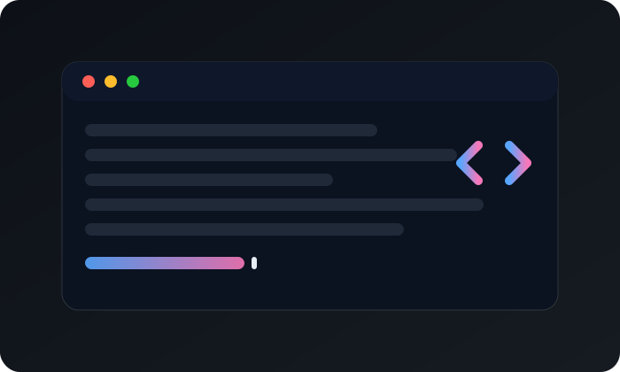

<!-- Optional header (enable if you like) -->
<!--
<h2 align="center">
	Welcome!
	
</h2>
-->

<!-- Intro -->
<h3 align="center">
	<samp>&gt; Hello World!, I am <b><a href="https://github.com/asif-a16">Asif</a></b></samp>
</h3>

	

	
	

 

<!-- About Section -->

# About me

  

  ✌️ &emsp; I enjoy solving problems and building practical software  
  ❤️ &emsp; Python is my main tool (and my favorite)  
  🧰 &emsp; Also comfortable with Kotlin, Java, Scala, C, and C#  

 

## Use to code

 

## LeetCode

	

 

	

 

 

<!-- Stats -->

	

	

	
	

